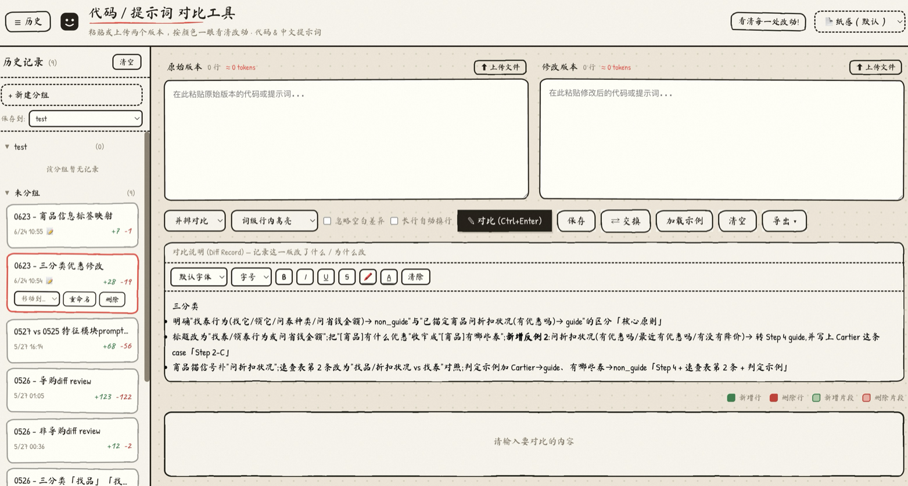
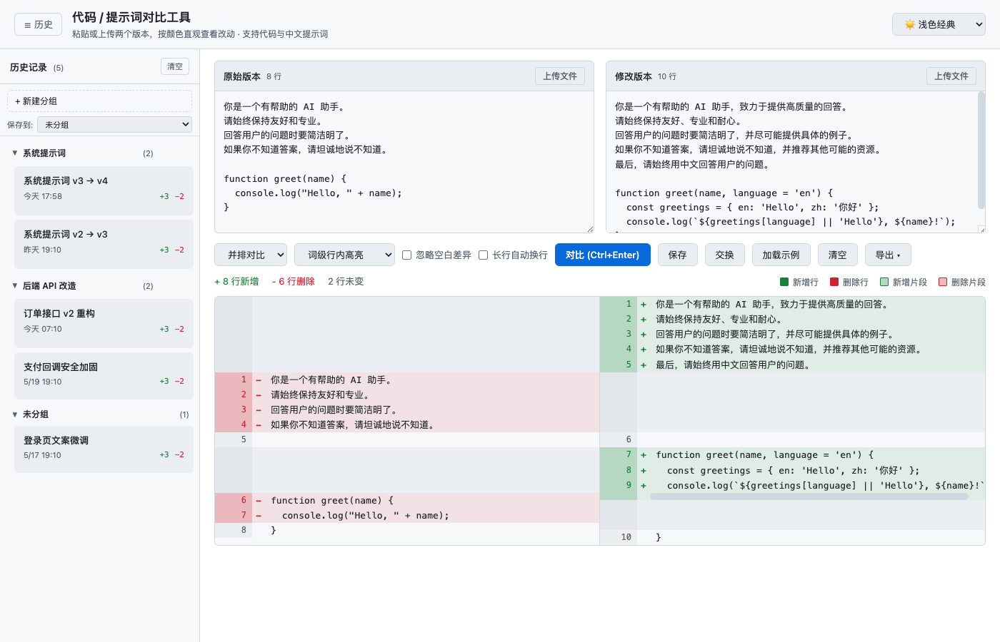
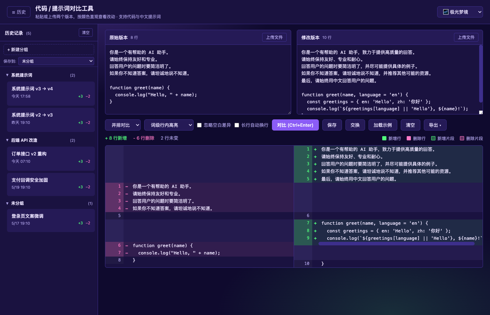
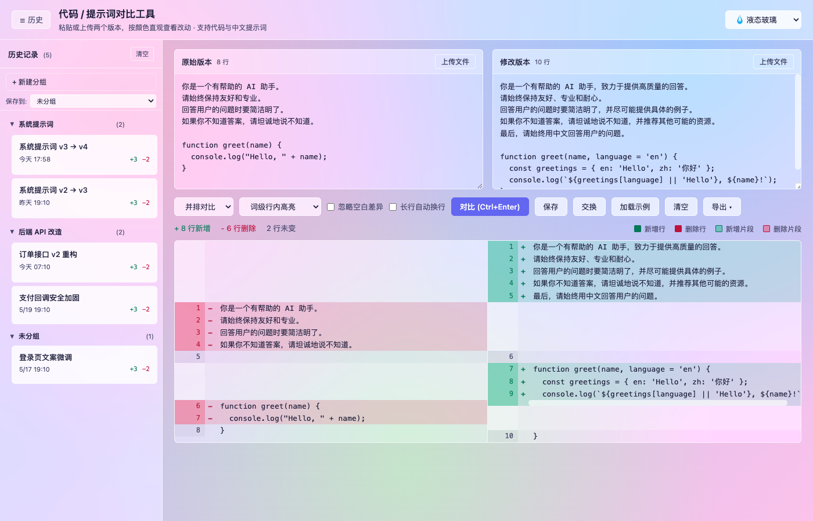
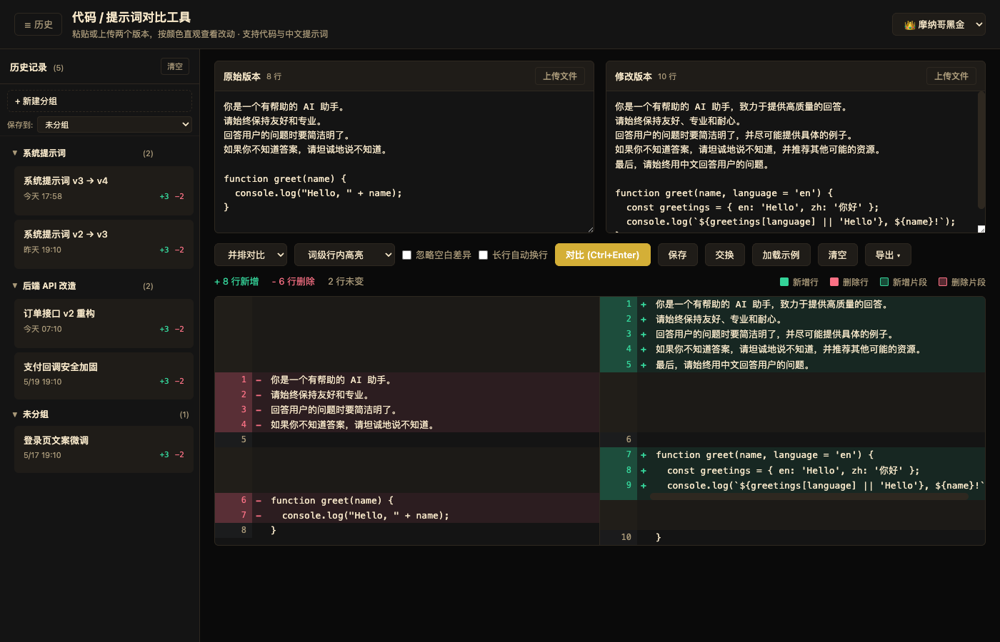
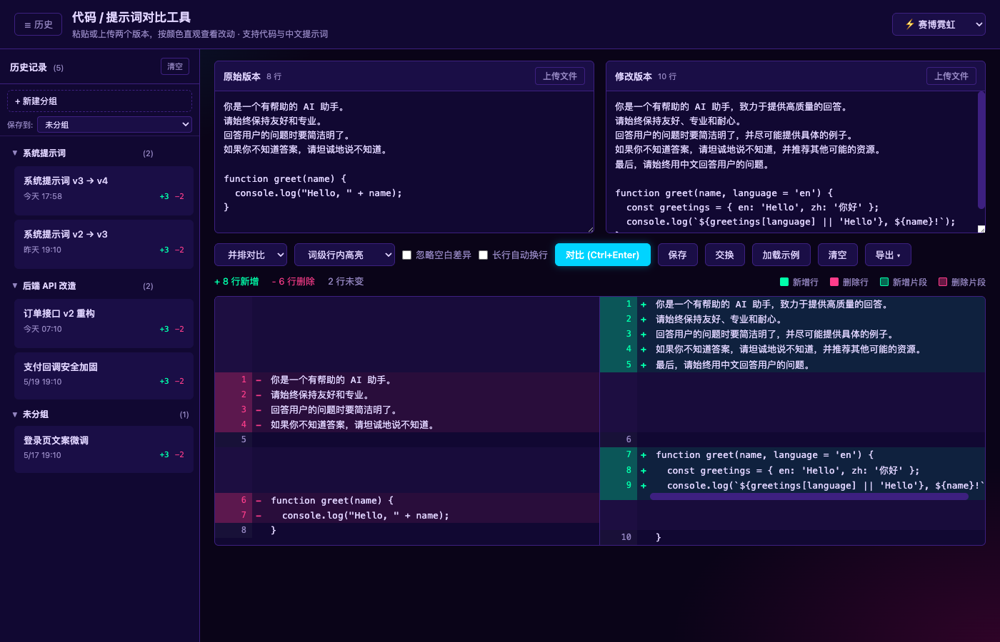
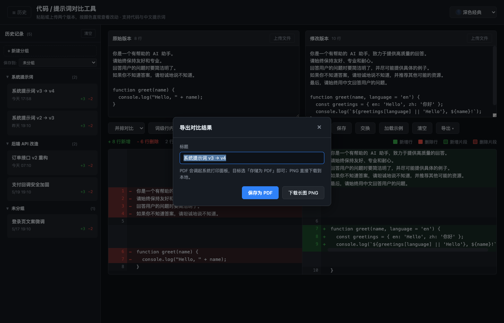

<div align="center">

# 代码 / 提示词对比工具

**两个版本的代码或提示词，一眼看清差异 · 一键导出 PDF / 长图分享**

[📥 下载安装](#-下载安装) · [✨ 功能特性](#-功能特性) · [🎨 主题预览](#-主题预览) · [🛠 从源码构建](#-从源码构建)



</div>

---

## 🌐 English summary

A tiny, offline diff viewer for code & LLM prompts. Side-by-side or unified view, word/char/line-level inline highlighting, 11 color themes, history with grouping, all stored locally in your browser — **no network calls, ever**.

- **macOS users** → download [CodeReviewTool.dmg](https://github.com/Looperswag/diff-viewer/releases/latest/download/CodeReviewTool.dmg)
- **Any other OS / just want the web app** → download [index.html](https://github.com/Looperswag/diff-viewer/releases/latest/download/index.html), double-click to open in your browser
- **PDF / long-screenshot export** built in — share two-version diffs as a single file with teammates

The whole tool is a single self-contained HTML file (~270 KB) with html2canvas inlined. No build step. No tracking. Right-click → Open on first macOS launch (ad-hoc signed, not notarized).

---

## 这是什么

一个轻量的本地差异对比工具，主要解决两个场景：

1. **代码 review** —— 把两段代码贴进来，按词/字符/行三档粒度直观看到改了什么，比 IDE 自带的 diff 友好得多
2. **提示词迭代** —— 系统提示词每改一版都难追溯？这里能保存历史、分组管理、并且导出 PDF / 长图发给合作方

整个工具就是一个 `index.html` 单文件，所有功能（包括 PDF/长图导出依赖的 html2canvas）都已内联，不联网、不上传、不调用任何第三方接口。数据通过浏览器 / WKWebView 的 `localStorage` 持久化在本机。

## ✨ 功能特性

| 功能 | 说明 |
|---|---|
| 🔀 **两种视图** | 并排对比 / 统一视图自由切换 |
| 🎯 **三档高亮粒度** | 词级 / 字符级 / 行级 —— 改了几个字也能精确高亮，不是只看到"整行红/绿" |
| 📤 **导出 PDF / 长图 PNG** | 一键导出当前对比结果，标题 + 时间戳 + 完整 diff 一张图分享 |
| 📚 **历史 + 分组** | 任意保存对比快照，左侧侧边栏自由切换、可拖入分组归类 |
| 🎨 **11 套主题** | 经典深 / 浅、液态玻璃、极光梦境、樱花 Ins、摩纳哥黑金、北欧极简、日落暮光、珍珠白、赛博霓虹、摩卡咖啡 |
| 🔧 **辅助选项** | 忽略空白差异、长行自动换行、文件直接上传、左右一键交换 |
| 🔒 **完全本地** | 不联网、不 telemetry、所有数据只在你本机的 `localStorage` |
| 📦 **零依赖单文件** | `index.html` 一个文件就是全部，html2canvas 已内联，可以扔到任何浏览器 |

## 📥 下载安装

### macOS 用户（推荐）

[**👉 下载 CodeReviewTool.dmg**](https://github.com/Looperswag/diff-viewer/releases/latest/download/CodeReviewTool.dmg)

打开 DMG 后把 `CodeReviewTool.app` 拖到 `Applications`。

**首次启动**：右键 App → 「打开」→ 弹窗中再点「打开」。这是因为应用未经苹果商店签名（只做了 ad-hoc 本地签名），需要手动放行一次，之后双击即可。

- 系统要求：macOS 11 Big Sur 及以上
- 架构：通用二进制（arm64 + x86_64），M 系列芯片和 Intel 都支持
- 体积：DMG 约 1.7 MB / App 约 1.8 MB

### 其他系统 / 想直接用浏览器

[**👉 下载 index.html**](https://github.com/Looperswag/diff-viewer/releases/latest/download/index.html)

下载后双击即可在任何现代浏览器（Chrome / Edge / Firefox / Safari）里打开。

> 因为是单文件、所有依赖都已内联，不需要装任何东西、不需要起服务器、不需要联网。直接双击 `index.html` 就能用。

也可以 `git clone` 这个仓库，根目录的 `index.html` 就是同一个文件。

## 🎨 主题预览

<table>
  <tr>
    <td align="center" width="50%">
      <br>
      <sub><b>☀️ 浅色经典</b></sub>
    </td>
    <td align="center" width="50%">
      <br>
      <sub><b>🌌 极光梦境</b></sub>
    </td>
  </tr>
  <tr>
    <td align="center" width="50%">
      <br>
      <sub><b>💧 液态玻璃</b></sub>
    </td>
    <td align="center" width="50%">
      <br>
      <sub><b>👑 摩纳哥黑金</b></sub>
    </td>
  </tr>
  <tr>
    <td align="center" width="50%">
      <br>
      <sub><b>⚡ 赛博霓虹</b></sub>
    </td>
    <td align="center" width="50%">
      <br>
      <sub><b>📤 PDF / 长图导出</b></sub>
    </td>
  </tr>
</table>

## 🔒 隐私 & 数据

- **完全本地**：所有运算（diff 计算、PDF/PNG 生成）都在你设备本地完成
- **不联网**：运行时不发起任何网络请求 —— 包括字体、CDN、telemetry 全部没有
- **html2canvas 已内联**：长图导出用的库已经打包进 `index.html`，离线也能用
- **数据存储**：历史记录通过浏览器 / WKWebView 的 `localStorage` 持久化，仅存于你本机；卸载即清除
- **macOS 套壳无沙箱外权限**：没有联网权限、没有文件访问权限、没有 telemetry

## 🛠 从源码构建

只需 macOS + Xcode Command Line Tools（`xcode-select --install`），不需要 Xcode IDE。

```bash
git clone https://github.com/Looperswag/diff-viewer.git
cd diff-viewer/build
./build.sh
open ../dist/CodeReviewTool.app
```

脚本会自动处理通用二进制编译、图标程序化生成、ad-hoc 签名、DMG 打包，产物落到 `dist/`。详细的开发说明在 [CONTRIBUTING.md](CONTRIBUTING.md)。


## 📄 许可证

[MIT](LICENSE) © 2026 Looperswag
